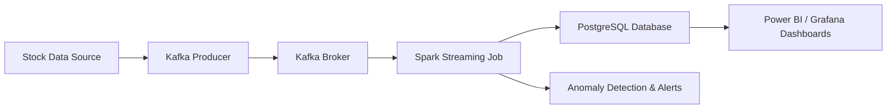

# Data Quality Monitoring

  ## 📌 Overview

    The Data Quality Monitoring project is a real-time distributed ETL pipeline designed to process high-volume stock market data efficiently.
    It integrates Apache Spark for parallel data processing, Apache Kafka for real-time data streaming, and PostgreSQL for storage,
    while leveraging Docker and Kubernetes for containerization and scalability.

    This system helps monitor data quality, detect anomalies, and trigger real-time alerts to ensure data reliability for analytics and reporting.

---

## ✨ Key Features

    * ⚡ Real-time ETL pipeline – Processes high-volume streaming stock data.
    * 🧩 Distributed Computing – Built with Apache Spark for parallel data processing.
    * 🔔 Real-time Alerts – Uses Kafka for low-latency data streaming and anomaly detection.
    * 🗄️ Efficient Storage – Stores processed data in PostgreSQL for downstream analytics.
    * 📊 Visualization Support – Integrates with Power BI and Grafana dashboards for monitoring.
    * 🐳 Containerized Deployment – Uses Docker and Kubernetes for scalable orchestration.

---

## 🛠️ Tech Stack

    | Category         |   Technology      |
    | -----------------| ----------------- |
    | Programming      | Python 3.9+       |
    | Data Processing  | Apache Spark      |
    | Streaming        | Apache Kafka      |
    | Database         | PostgreSQL        |
    | Dashboarding     | Power BI, Grafana |
    | Containerization | Docker            |
    | Orchestration    | Kubernetes        |
    | Version Control  | Git & GitHub      |

---

## 📂 Project Architecture



---

## 🚀 Getting Started

### 1️⃣ Clone the Repository

```bash
git clone https://github.com/SatwikaKadiyala/Data-Quality-Monitoring.git
cd Data-Quality-Monitoring
```

### 2️⃣ Set Up Virtual Environment

```bash
python3 -m venv venv
source venv/bin/activate   # For Linux/Mac
venv\Scripts\activate      # For Windows
```

### 3️⃣ Install Dependencies

```bash
pip install -r requirements.txt
```

### 4️⃣ Start Kafka & Zookeeper

```bash
# Start Zookeeper
zookeeper-server-start.sh config/zookeeper.properties

# Start Kafka Broker
kafka-server-start.sh config/server.properties
```

### 5️⃣ Start Spark Streaming Job

```bash
spark-submit \
  --master local[*] \
  --packages org.apache.spark:spark-sql-kafka-0-10_2.12:3.5.0 \
  src/etl_pipeline.py
```

### 6️⃣ Run PostgreSQL Database

```bash
docker-compose up -d
```

### 7️⃣ Deploy on Kubernetes

```bash
kubectl apply -f k8s/
```

---

## 📊 Dashboards

     * Power BI → Visualizes processed stock data and monitors anomalies.
     * Grafana → Tracks streaming metrics and real-time alerts.

---

## 📌 Future Enhancements

    * ✅ Integrate Redis caching for faster reads.
    * ✅ Add machine learning anomaly detection models.
    * ✅ Improve fault tolerance and auto-recovery in Kubernetes.


